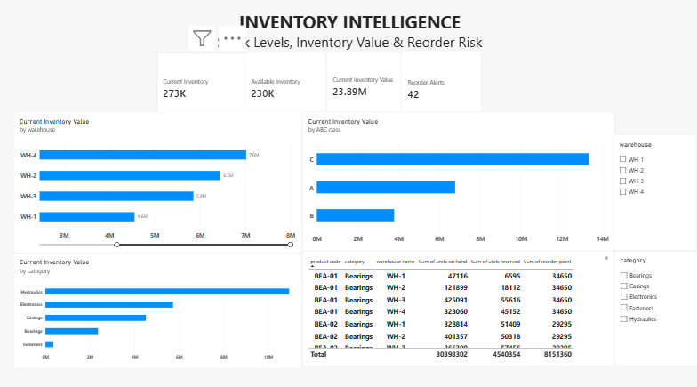
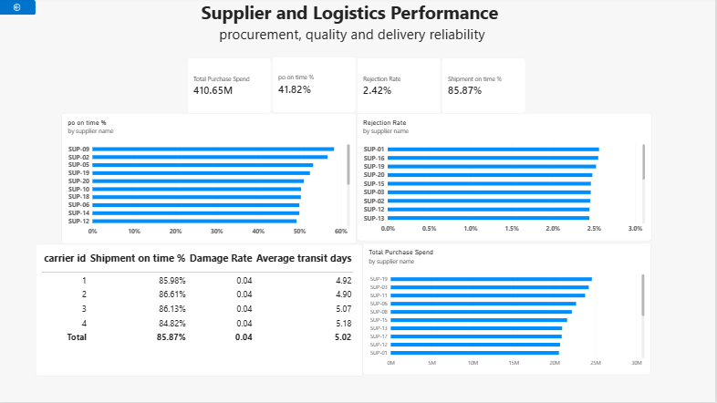

# Supply Chain & Inventory Analytics

An end-to-end data analytics project using **Python** for data preparation and analysis and **Power BI** for interactive business intelligence reporting.

The project focuses on inventory health, procurement performance, supplier quality, logistics reliability, and revenue trends across the supply chain.

## Project Objectives

- Analyze overall supply chain performance through key business KPIs.
- Evaluate current inventory levels, inventory value, and reorder risk.
- Compare supplier purchase spend, delivery reliability, and rejection rates.
- Assess carrier performance using on-time delivery, damage rate, and transit time.
- Build a clear and interactive Power BI dashboard for decision-making.

## Tools Used

- **Python**
- **Pandas**
- **Jupyter Notebook**
- **Power BI**
- **DAX**

## Workflow

**Raw Data → Python/Pandas → Data Cleaning & Transformation → Exploratory Analysis → Power BI Data Model → DAX Measures → Interactive Dashboard → Business Insights**

## Python Analysis

Python and Pandas were used to prepare the dataset before visualization. The analysis included:

- Data quality checks and duplicate validation
- Missing-value handling
- Date and datatype preparation
- Creation of useful analytical fields
- Inventory availability and stock-status calculations
- Purchase-order delivery analysis
- Supplier rejection metrics
- Production efficiency metrics
- Shipment transit-time analysis

[View the Python notebook](./data_Analysis%20%281%29.ipynb)

## Power BI Dashboard

The final Power BI report contains three pages designed for different business questions.

### 1. Executive Overview

Provides a high-level view of procurement, revenue, supplier, and logistics performance.

Key KPIs include:
- **Total Revenue:** 327.23M
- **Total Purchase Spend:** 410.65M
- **Shipment On-Time Rate:** 85.87%

### 2. Inventory Intelligence

Focuses on current stock position, inventory value, warehouse distribution, ABC classification, and reorder risk.

Key KPIs include:
- **Current Inventory:** 273K units
- **Available Inventory:** 230K units
- **Current Inventory Value:** 23.89M
- **Reorder Alerts:** 42

### 3. Supplier & Logistics Performance

Compares suppliers and carriers across procurement quality and delivery reliability.

Key KPIs include:
- **Purchase Order On-Time Rate:** 41.82%
- **Rejection Rate:** 2.42%
- **Shipment On-Time Rate:** 85.87%

The page also compares supplier spend, supplier on-time performance, rejection rates, carrier damage rates, and average transit days.

## Key Insights

- **Hydraulics** generated the highest revenue and also represented the highest-value inventory category in the dashboard.
- Current inventory is approximately **273K units**, while about **230K units** remain available after reservations.
- The latest inventory snapshot contains **42 reorder alerts**, identifying products that require attention.
- Shipment performance is relatively strong at about **85.87% on-time delivery**.
- Purchase-order on-time performance is substantially weaker, highlighting an opportunity to improve supplier delivery reliability.
- Supplier rejection rates and carrier performance vary across suppliers and logistics partners, allowing underperforming partners to be identified.

## Files in This Repository

- `data_Analysis (1).ipynb` — Python data preparation and analysis notebook
- `Supply_Chain_analytics.pbix` — Interactive Power BI report
- `Executive_Overview.png` — Executive dashboard screenshot
- `Inventory_Intelligence.png` — Inventory dashboard screenshot
- `Supplier_Logistics.png` — Supplier and logistics dashboard screenshot

## Skills Demonstrated

**Data Cleaning | Exploratory Data Analysis | Pandas | KPI Design | Data Modeling | DAX | Power BI | Dashboard Development | Supply Chain Analytics | Business Intelligence**

## Project Outcome

This project demonstrates a complete analytics workflow from raw operational data to an interactive business dashboard, with a focus on converting supply chain data into actionable insights for inventory, procurement, supplier, and logistics decisions.
